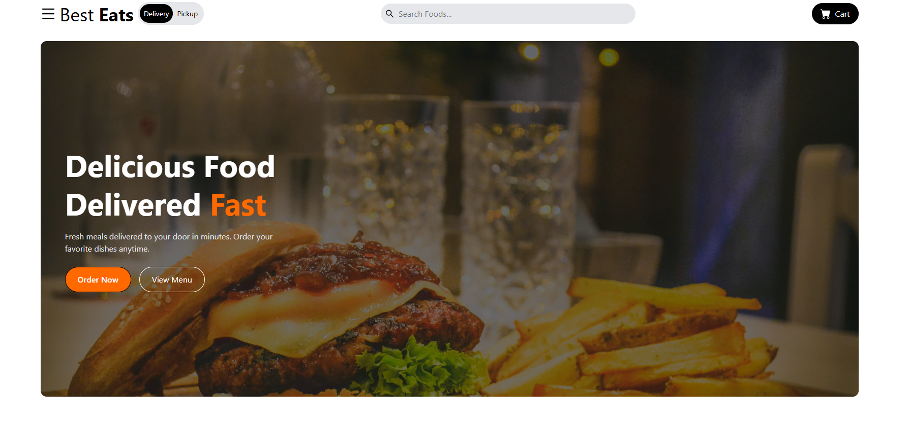
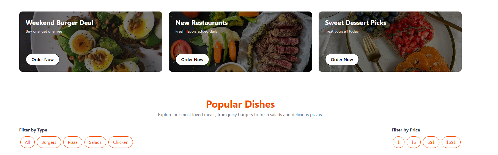
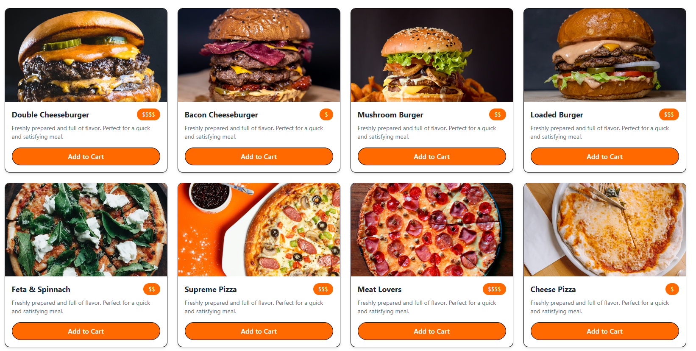
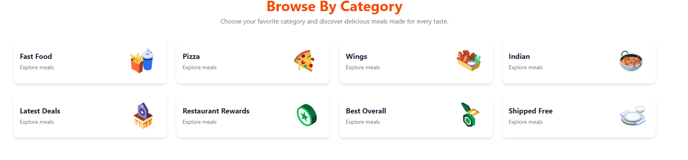
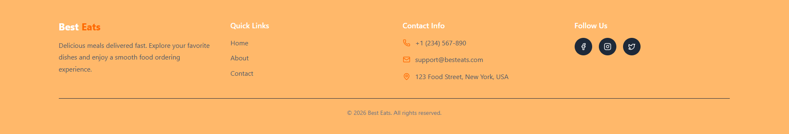

# Best Eats

A modern and responsive food ordering storefront built with React, Vite, Tailwind CSS, and React Router.

---

## ✨ Features

- Responsive food storefront UI
- Reusable React components
- Client-side routing with React Router
- Modern hero section and promotional cards
- Product grid with category and price filters
- About and Contact pages
- Mobile-friendly navigation
- Clean and scalable project structure

---

## 🛠️ Tech Stack

- React
- Vite
- Tailwind CSS
- React Router DOM
- Lucide React
- React Icons

---

## 📄 Pages

- Home
- About
- Contact

---

## 🧩 Components

- Navbar
- Hero
- HeadlineCards
- Food
- Category
- Footer

---

## 📸 Screenshots







---

## 🚀 Getting Started

Clone the project:

```bash
git clone https://fastfood-shop.vercel.app
```

🎯 Project Goal

This project was built to practice component-based architecture, responsive storefront UI design, routing, filtering logic, and reusable frontend development with React.

---

🔧 Future Improvements
Add real search functionality
Add cart state management
Add product detail pages
Improve accessibility
Connect to a backend or API
Add animations and smoother interactions
